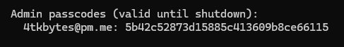

# Admin guide

If you did want to self-host this website for yourself and want to do moderation/takedowns, here is the guide:

## how to set

In your `.env` file, create a key called "VALID_ADMIN_EMAILS" and added the emails (comma separated). 

## where to find

On the startup of the backend, you can find it in the terminal:

This password only lasts for the lifetime of the backend, and will get reset on shutdown (for security purposes). 

---

You can change between a normal user and admin by either logging in with your standard email+password or using your one-time password. 